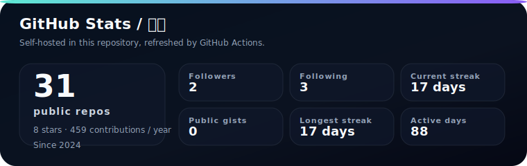
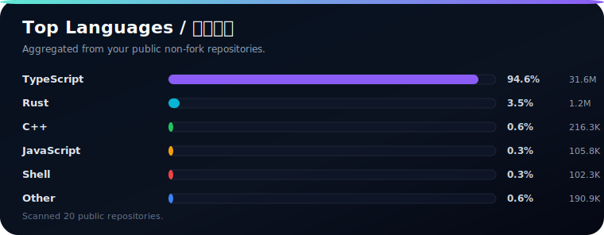
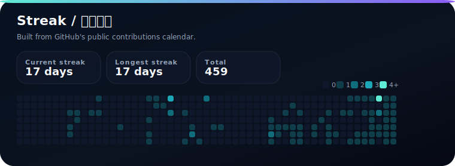

# lezi-fun

**学生 · 独立开发者 / Student · Indie Developer**

[lezi.chat](https://lezi.chat) · [ghbot](https://github.com/lezi-fun/ghbot) · [nodew-api](https://github.com/lezi-fun/nodew-api) · [cppp](https://github.com/lezi-fun/cppp)

  

---

### About Me / 关于我

我是一名学生，也是一名独立开发者，喜欢把想法做成真正能用的东西。

I build things that are fast to use, easy to understand, and actually useful.

### Tech Stack / 技术栈

  
  
  
  
  
  
  
  
  

  
  
  

### What I Build / 我在做什么

- Web products and developer-facing applications
- Open-source automation and workflow tooling
- Practical utilities that save time in day-to-day development

### Featured Projects / 项目展示

<table>
  <tr>
    <td width="50%">
      <a href="https://github.com/lezi-fun/ghbot"><strong>ghbot</strong></a> 
      GitHub PR review bot powered by Codex CLI. 
      GitHub 自动审查机器人，支持严格/宽松审查、内联评论和合并流程。
    </td>
    <td width="50%">
      <a href="https://github.com/lezi-fun/nodew-api"><strong>nodew-api</strong></a> 
      One API-style gateway with relay, routing, tokens, and admin console. 
      面向 OpenAI-compatible 中转、渠道路由、令牌管理和后台控制台。
    </td>
  </tr>
  <tr>
    <td width="50%">
      <a href="https://github.com/lezi-fun/cppp"><strong>cppp / c+++</strong></a> 
      Modern C++ build system with agent mode and incremental builds. 
      现代化 C++ 构建系统，支持交互菜单、AI Agent 和增量编译。
    </td>
    <td width="50%">
      <a href="https://lezi.chat"><strong>lezi.chat</strong></a> 
      Personal website / 个人网站
    </td>
  </tr>
</table>

### Stats / 数据

### Top Languages / 语言分布

### Streak / 连续贡献

  Self-hosted SVGs generated in this repository.

### Contact / 联系方式

  <a href="https://lezi.chat">Website / 个人网站</a>

