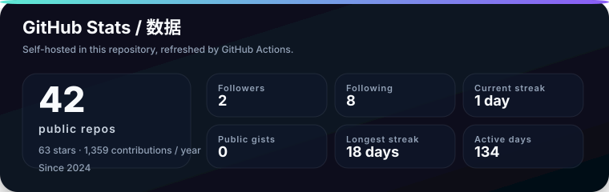
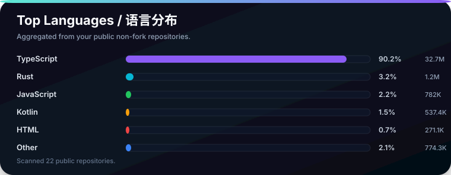
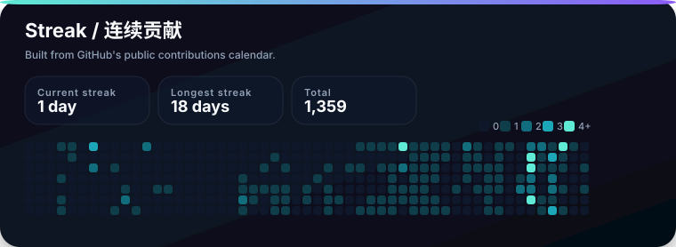

# lezi-fun

**学生 · 独立开发者 / Student · Indie Developer**

[lezi.chat](https://lezi.chat) · [ghbot](https://github.com/lezi-fun/ghbot) · [nodew-api](https://github.com/lezi-fun/nodew-api) · [codex-webui](https://github.com/lezi-fun/codex-webui) · [cpppp](https://github.com/lezi-fun/cpppp)

  

---

### About Me / 关于我

我是一名学生，也是一名独立开发者，喜欢把想法做成真正能用的东西。

I build things that are fast to use, easy to understand, and actually useful.

### Tech Stack / 技术栈

  
  
  
  
  
  
  
  
  

  
  

### What I Build / 我在做什么

- Web products and developer-facing applications
- Open-source automation and workflow tooling
- Practical utilities that save time in day-to-day development
- Upstream contributions — currently hardening MCP resources API & SSE reliability in [M365-Copilot2API (PR #48)](https://github.com/HEXUXIU/M365-Copilot2API/pull/48)

### Featured Projects / 项目展示

<table>
  <tr>
    <td width="50%">
      <a href="https://github.com/lezi-fun/ghbot"><strong>ghbot</strong></a> 
      AI GitHub App that reviews pull requests and optionally merges clean PRs. 
      自动审查 Pull Request 的 AI GitHub App，可选自动合并干净的 PR。
    </td>
    <td width="50%">
      <a href="https://github.com/lezi-fun/nodew-api"><strong>nodew-api</strong></a> 
      Node.js/TS edition of One API — relay, channel routing, tokens, usage logging. 
      OpenAI 兼容中转网关：渠道路由、令牌管理、用量日志。
    </td>
  </tr>
  <tr>
    <td width="50%">
      <a href="https://github.com/lezi-fun/codex-webui"><strong>codex-webui</strong></a> 
      Local/LAN WebUI for the Codex app-server — approvals, streaming tools, review diffs, mobile support. 
      Codex 本地/局域网 WebUI：审批流、工具流式调用、审查 diff，支持手机访问。
    </td>
    <td width="50%">
      <a href="https://github.com/lezi-fun/cpppp"><strong>cpppp / c+++</strong></a> 
      Modern C++ build system: interactive menu, AI Agent mode, incremental builds, project TOML. 
      现代化 C++ 编译系统：交互菜单 · AI Agent 模式 · 增量编译 · 项目 toml · 对拍测试。
    </td>
  </tr>
  <tr>
    <td width="50%">
      <a href="https://github.com/lezi-fun/masker"><strong>masker</strong></a> 
      macOS text sanitizer — auto-detect sensitive info, UUID replacement, AI processing with one-click restore. 
      macOS 文本脱敏工具：自动检测敏感信息、UUID 替换、AI 处理后一键还原。
    </td>
    <td width="50%">
      <a href="https://github.com/lezi-fun/subconverter-rs"><strong>subconverter-rs</strong></a> 
      Subconverter re-implemented in Rust. 
      subconverter 的 Rust 实现。
    </td>
  </tr>
</table>

### Stats / 数据

### Top Languages / 语言分布

### Streak / 连续贡献

  Self-hosted SVGs generated in this repository.

### Contact / 联系方式

  <a href="https://lezi.chat">Website / 个人网站</a>

>Be LEZI(fun)!
